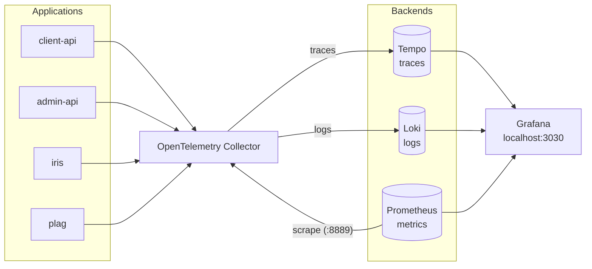

# Local observability stack

A Docker Compose profile for checking traces, logs and metrics on a local machine.
It is not required for regular development.

```sh
docker compose --profile observability up -d
```

# Architecture



- Applications send telemetry to the collector over OTLP gRPC (`:4317`).
- The collector exports traces to Tempo and logs to Loki, and exposes metrics on `:8889` for Prometheus to scrape.
- Prometheus also scrapes the collector's own telemetry (`:8888`) and RabbitMQ (`:15692`) directly.
- Tempo's metrics generator writes span metrics and service graphs to Prometheus via remote write.
- Grafana queries Tempo, Loki and Prometheus. The datasources are provisioned on startup.

# Components

| Service              | Image                                          | Host port | Config                                                |
| -------------------- | ---------------------------------------------- | --------- | ----------------------------------------------------- |
| `otel-collector`     | `otel/opentelemetry-collector-contrib:0.161.0` | 4317      | `otel-collector.yaml`                                 |
| `tempo`              | `grafana/tempo:2.8.2`                          | 3200      | `tempo.yaml`                                          |
| `loki`               | `grafana/loki:3.5.7`                           | 3100      | `loki.yaml`                                           |
| `prometheus`         | `prom/prometheus:v3.7.3`                       | 9090      | `prometheus.yaml`                                     |
| `grafana`            | `grafana/grafana:12.3.0`                       | 3030      | `grafana-datasources.yaml`, `grafana-dashboards.yaml` |
| `grafana-dashboards` | `curlimages/curl:8.16.0`                       | -         | `download-dashboards.sh`                              |

# Dashboards

`grafana-dashboards` downloads community dashboards from grafana.com before Grafana starts.
Each dashboard is pinned by gnetId and revision in `download-dashboards.sh`.

| Dashboard               | gnetId | Revision |
| ----------------------- | ------ | -------- |
| RabbitMQ Overview       | 10991  | 12       |
| OpenTelemetry Collector | 15983  | 30       |

The first startup needs internet access. If a download fails, Grafana still starts and keeps any previously downloaded files.

# Differences from the cluster

Same as the cluster:

- Image versions follow the cluster's chart versions.
- Prometheus scrapes application metrics from the collector's `:8889`.
- Prometheus scrapes RabbitMQ directly.
- Loki's OTLP index labels and Tempo's metrics generator processors.
- RabbitMQ Overview dashboard revision.

Local only:

- The collector's own telemetry (`:8888`) and the OpenTelemetry Collector dashboard.
- The collector's `debug` exporter, which prints all received telemetry to its stdout.
- Grafana allows anonymous access as Admin.
- Storage is on local Docker volumes.
