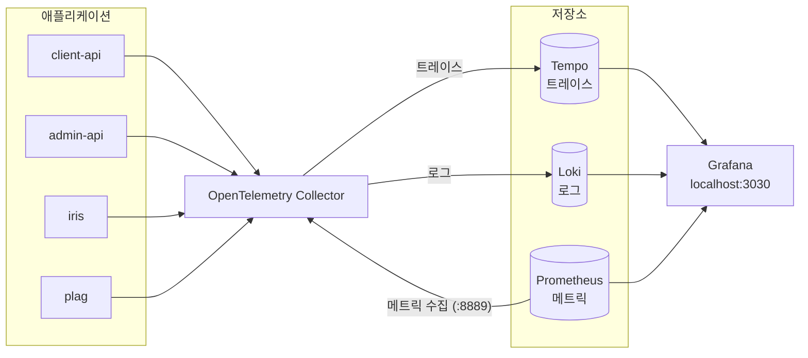

# 로컬 관측성 스택

로컬에서 트레이스·로그·메트릭을 확인하기 위한 Docker Compose 프로필입니다.
평소 개발에는 필요 없습니다.

```sh
docker compose --profile observability up -d
```

## 구성도



- 애플리케이션은 OTLP gRPC(`:4317`)로 수집기에 텔레메트리를 보냅니다. iris·plag는 로컬 기본 설정으로는 보내지 않으니, 실행할 때 `DISABLE_INSTRUMENTATION=false OTEL_EXPORTER_OTLP_ENDPOINT_URL=localhost:4317`을 셸 변수로 지정하세요.
- 수집기는 트레이스를 Tempo로, 로그를 Loki로 보내고, 메트릭은 `:8889`에 노출해 Prometheus가 가져가게 합니다.
- Prometheus는 수집기 자체 메트릭(`:8888`)과 RabbitMQ(`:15692`)도 직접 가져갑니다.
- Tempo는 트레이스로부터 span 메트릭과 서비스 그래프를 만들어 Prometheus로 보냅니다(remote write).
- Grafana는 Tempo·Loki·Prometheus를 조회합니다. 데이터소스는 기동 시 자동으로 등록됩니다.

## 구성 요소

| 서비스               | 이미지                                         | 호스트 포트 | 설정 파일                                             |
| -------------------- | ---------------------------------------------- | ----------- | ----------------------------------------------------- |
| `otel-collector`     | `otel/opentelemetry-collector-contrib:0.161.0` | 4317        | `otel-collector.yaml`                                 |
| `tempo`              | `grafana/tempo:2.8.2`                          | 3200        | `tempo.yaml`                                          |
| `loki`               | `grafana/loki:3.5.7`                           | 3100        | `loki.yaml`                                           |
| `prometheus`         | `prom/prometheus:v3.7.3`                       | 9090        | `prometheus.yaml`                                     |
| `grafana`            | `grafana/grafana:12.3.0`                       | 3030        | `grafana-datasources.yaml`, `grafana-dashboards.yaml` |
| `grafana-dashboards` | `curlimages/curl:8.16.0`                       | -           | `download-dashboards.sh`                              |
