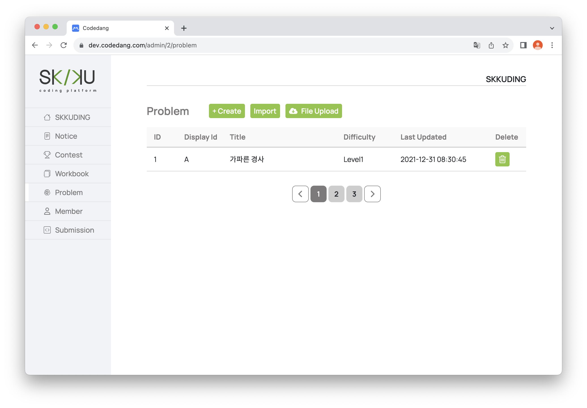
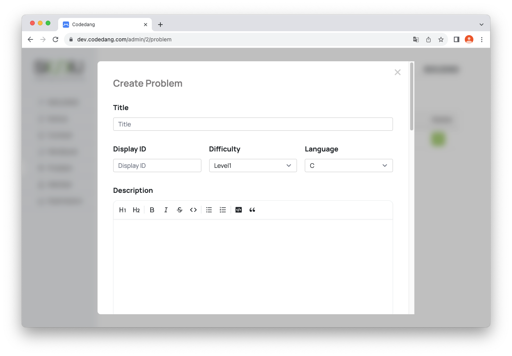

# 문제 생성 및 관리하기
본 Section에서는 문제를 생성하고 관리하는 기능들을 소개합니다.

## 문제 생성 및 삭제하기
관리자들은 상단 Header 중 Group을 눌러 자신이 속한 그룹들을 확인할 수 있습니다.

이때, 자신이 GroupLeader로 속한 그룹은 그룹명 우측 상단에 톱니바퀴(⚙️) 모양의 아이콘이 뜨게 됩니다.

톱니바퀴 아이콘(⚙️)을 클릭시 관리자용 그룹 창으로 이동하게 됩니다.

 

관리자는 옆 Problem 탭을 통해 관리자용 Problem 창으로 이동할 수 있습니다. 

 

### 문제 생성하기

그룹 내에서 문제를 생성할 수 있는 방법은 세 경우가 있습니다.

- __문제를 직접 생성하는 경우__ (<code>Create</code>버튼)

  <code>Create</code>버튼을 누르면 직접 문제를 생성할 수 있습니다.
   
  문제의 세부 구성사항은 아래와 같습니다.
  - __Title__ : 문제의 제목을 설정합니다.
  - __Difficulty__ : 문제의 난이도를 설정합니다 Level 1~5까지 존재합니다.
  - __Language__ : 문제의 지원언어를 설정합니다. 종류는 `C`, `C++`,`Java`, `Python3`로 이루어져 있습니다.
  - __Description__ : 문제의 설명을 설정합니다.
  - __Input Description__ : 입력과 관련한 설명을 설정합니다.
  - __Output Description__ : 출력과 관련한 설명을 설정합니다.
  - __Time Limit(ms)__ : 시간 제한을 설정합니다. 단위는 ms(밀리초)입니다.
  - __Memory Limit(MB)__ : 메모리 제한을 설정합니다. 단위는 MB(메가바이트)입니다.
  - __Hint__ : 표시될 힌트를 설정합니다.
  - __Input Sample, Output Sample__ : 사용자에게 보여질 입력, 출력 예시를 설정합니다.
  - __Testcase__ : 테스트케이스를 설정합니다.

- __문제를 Import하는 경우__ (<code>Import</code>버튼)

  추후 추가할 예정입니다.

- __문제를 파일로 업로드 하는 경우__   (<code>File Upload</code>버튼)

  Excel 파일을 업로드하여 여러 개의 문제 및 테스트 케이스들을 업로드할 수 있습니다.

### 문제 삭제하기

문제 옆 🗑️ 버튼을 클릭하면 문제를 삭제할 수 있습니다. 

