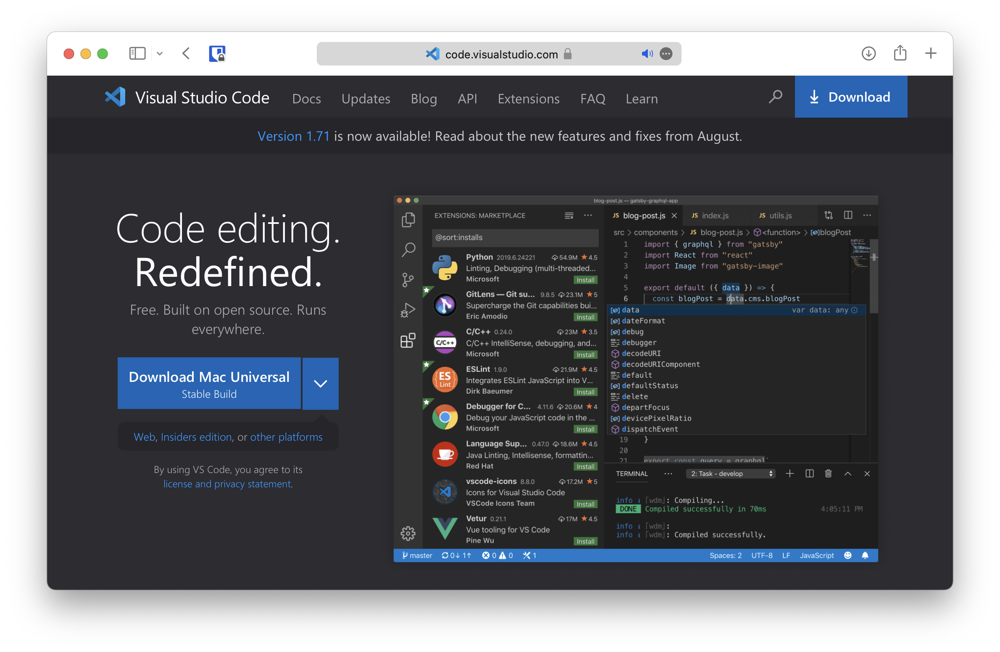
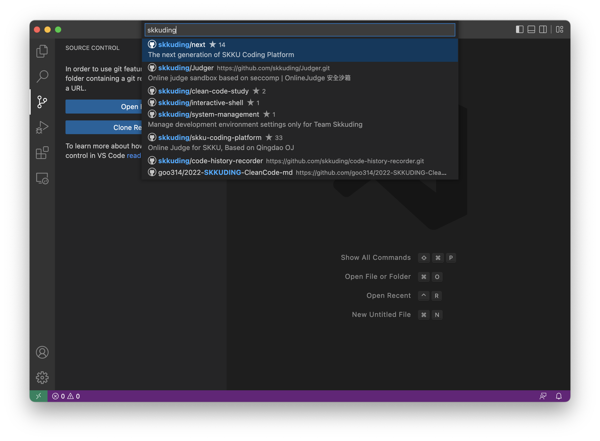
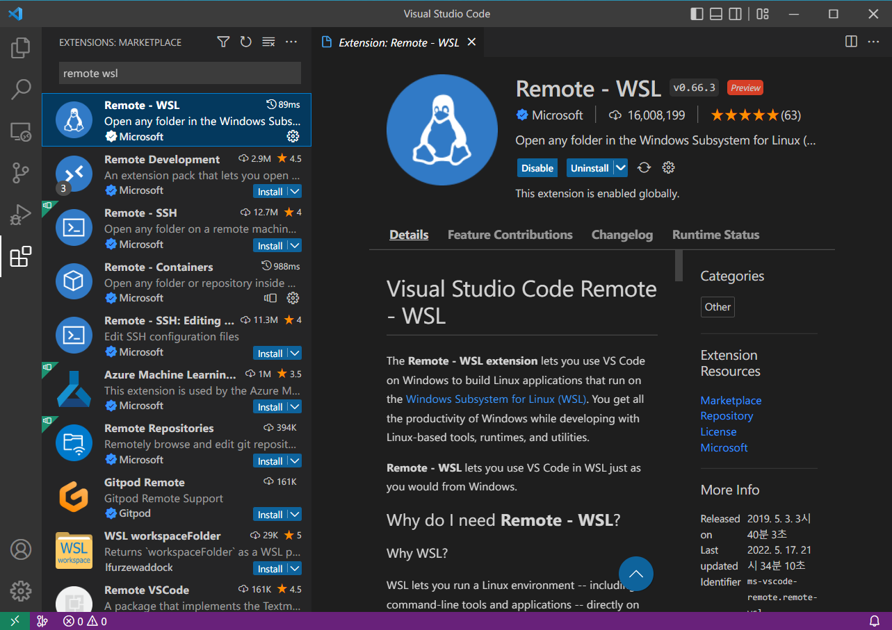
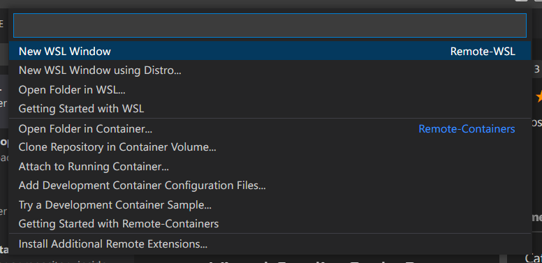
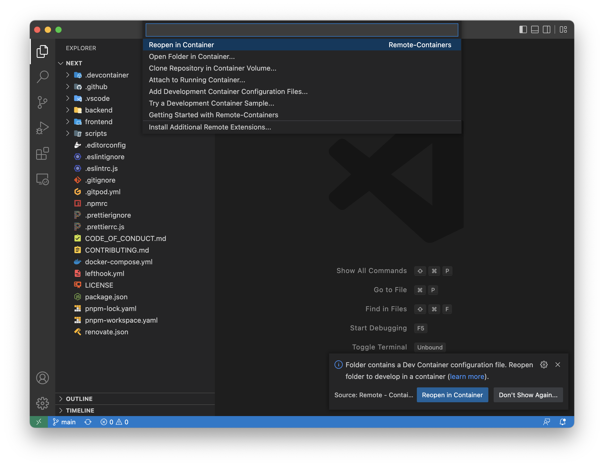
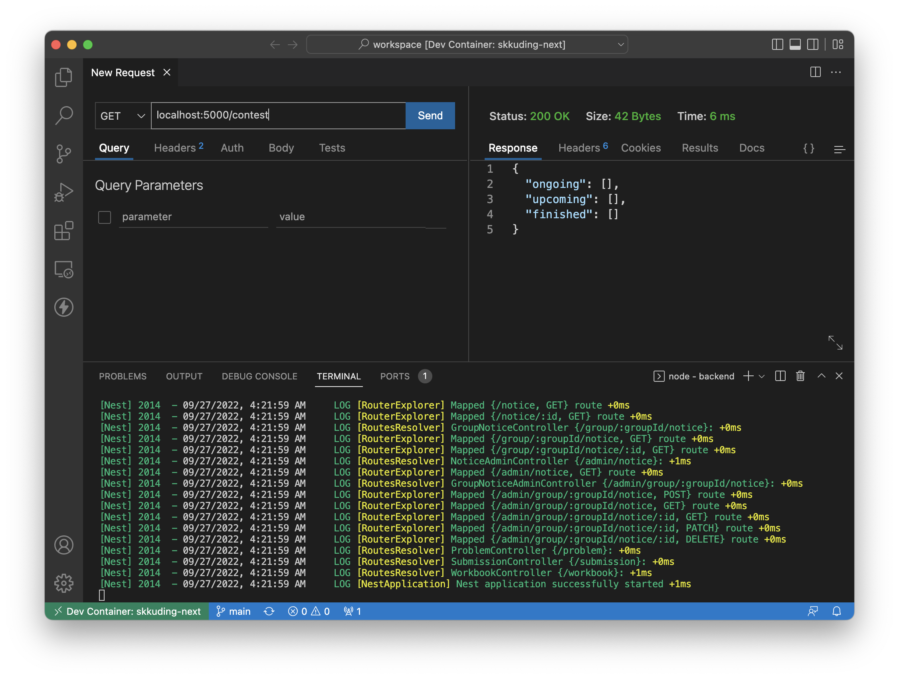

# Getting Started!

스꾸딩 팀과 함께 SKKU Coding Platform 개발을 시작하려면 아래 가이드를 따라주세요.
가능한 개발 환경은 크게 세 가지가 있습니다.

1. Visual Studio Code + Container
2. GitPod
3. Manual

가장 권장하는 개발 환경은 Container 내에서 개발하는 Visual Studio Code이지만, 어려울 경우에는 GitPod을 이용하거나 직접 세팅할 수도 있습니다. 

## Visual Studio Code (이하 VSCode)

### 1. 기본 도구 설치 (Git, WSL2(Windows), Docker)

- **Git**: Windows는 [https://git-scm.com/download/win](https://git-scm.com/download/win)에서 다운로드하고, Mac은 [https://git-scm.com/download/mac](https://git-scm.com/download/mac)에서 다운로드합니다.
Linux는 패키지 관리도구로 쉽게 설치할 수 있습니다. (예: Debian 계열인 경우 `sudo apt install git-all`)

- **WSL2(Windows)**: 자세한 설치 방법은 [WSL 설치 공식 가이드](https://docs.microsoft.com/ko-kr/windows/wsl/install)를 참고해주세요.

- **Docker**: Windows는 WSL2를 먼저 설치하고, [Docker Desktop for Windows](https://docs.docker.com/desktop/install/windows-install/)를 설치하면 됩니다. 
Mac은 [Docker Desktop for Mac](https://docs.docker.com/desktop/install/mac-install/)을 설치하면 됩니다.
Linux는 자신의 배포판에 맞는 버전을 [공식 홈페이지](https://docs.docker.com/engine/install/)에서 찾아 설치하면 됩니다.

### 2. VSCode 설치

[VSCode 홈페이지](https://code.visualstudio.com/)에서 VSCode 설치 파일을 다운로드 받고, 파일을 실행하여 설치합니다.



### 3. Remote - Containers 확장 설치

왼쪽의 'Extensions' icon을 눌러(단축키 Ctrl+Shift+X, ⇧⌘X) "remote containers"를 검색창에 입력합니다.
'Remote - Containers'를 선택하고 'Install' 버튼을 눌러 설치합니다.


### 4. Clone Repository

GitHub에서 [skkuding/next](https://github.com/skkuding/next) repository를 clone 받습니다.
왼쪽의 'Source Control' icon을 눌러(단축키 Ctrl+Shift+G, ⌃⇧G) 'Clone Repository' 버튼을 누르고, skkuding/next를 검색하여 원하는 위치에 받습니다.

::: warning Windows 유저라면...
Windows file system에 clone 받는 것보다 WSL file system에 clone 받는 것을 권장합니다.
[파일 저장 시 인식하지 못하는 문제](https://github.com/microsoft/WSL/issues/4739)를 비롯한 여러 문제가 있습니다.
WSL에 clone 받는 방법은 아래 셜명을 참고해주세요.
:::



### 4-1. WSL에 Clone 받기

3번처럼 'Extensions' 탭을 열어 "remote wsl"을 검색창에 입력합니다.
'Remote - WSL'을 선택하고 'Install' 버튼을 눌러 설치합니다.



왼쪽 아래의 `><` 모양 아이콘을 누르고 'New WSL Window' 옵션을 선택하여 WSL 환경에서 VSCode를 시작합니다.



이후 4번과 같은 방식으로 WSL 내에 clone하면 됩니다.

### 5. VSCode로 repository 열기

왼쪽의 'Explorer' icon을 눌러(단축키 Ctrl+Shift+E, ⇧⌘E) 'Open Folder' 버튼을 누르고, clone 받았던 repository 폴더를 엽니다.

Repository가 열리면 좌측 하단의 `><` 모양 아이콘을 누르고, "Reopen in Container" 옵션을 선택합니다.
이후 자동으로 Docker container가 생성되며 도구와 라이브러리, VSCode 확장들이 설치됩니다.
초기 구성에는 5~10분 정도 소요되지만, 다시 실행할 때에는 오래 걸리지 않습니다.



### 6. Preview server 열기

Container 세팅이 완료되면, 터미널을 열어(단축키 Ctrl+\`, ⌃\`) 명령어를 입력해 개발용 preview server를 시작합니다.

#### Frontend

```sh
cd frontend
pnpm dev
```

Story(component 문서)를 보고 싶으면, `pnpm story` 명령어를 입력해주세요.


#### Backend

```sh
cd backend
pnpm start:dev
```

왼쪽의 Thunder Client 아이콘을 눌러 API를 테스트해볼 수 있습니다.



## GitPod

컴퓨터의 사양이 부족하거나 로컬 개발 환경이 제한적인 경우 브라우저로 원격 개발을 하는 GitPod이 좋습니다.
한 달에 50시간까지 무료고, 학생 인증을 하면 한 달에 9달러로 제한 없이 사용할 수 있습니다.
아래 버튼을 눌러 바로 시작하거나 아래 설명을 따르면 됩니다.

[](https://gitpod.io/#https://github.com/skkuding/next)

### 1. GitHub Repository 열기

브라우저에서 [skkuding/next](https://github.com/skkuding/next) repository를 엽니다.

> TODO: img

### 2. URL 입력

GitHub 전체 URL의 앞에 `gitpod.io/#`을 입력하고 해당 주소로 접속합니다.  
예: `gitpod.io/#https://github.com/skkuding/next`

::: tip
GitPod은 branch, pull request, commit 등의 context 별로 workspace를 생성하는 것도 가능합니다!

- Branch `123-feat-name`의 코드로 workspace를 생성하려면: `gitpod.io/#https://github.com/skkuding/next/tree/123-feat-name`
- PR #123의 코드로 workspace를 생성하려면: `gitpod.io/#https://github.com/skkuding/next/pull/123`

더 자세한 내용은 [공식 문서](https://www.gitpod.io/docs/introduction/learn-gitpod/context-url)에서 확인해주세요.
:::

> TODO: img

### 3. GitHub 계정 연결

화면에 나오는 대로 GitHub 계정을 GitPod에 연결합니다.

> TODO: img

### 4. Preview server 열기

GitPod이 자동으로 세팅을 마치면 [위의 Visual Studio Code와 같은 방법](#_6-preview-server-열기)으로 preview server를 열 수 있습니다.

## Manually

::: warning Not Recommended 🤔
직접 모든 환경을 세팅하는 것은 특별한 경우가 아니라면 권장하지 않습니다.  
꼭 필요한 경우에만 사용해주세요!
:::

::: warning Work in Progress 🚧
아직 작성 중입니다. 조금만 기다려주세요! 🙏
:::
