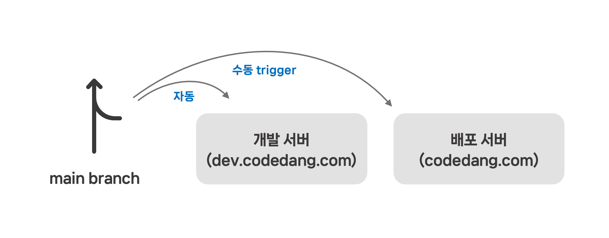
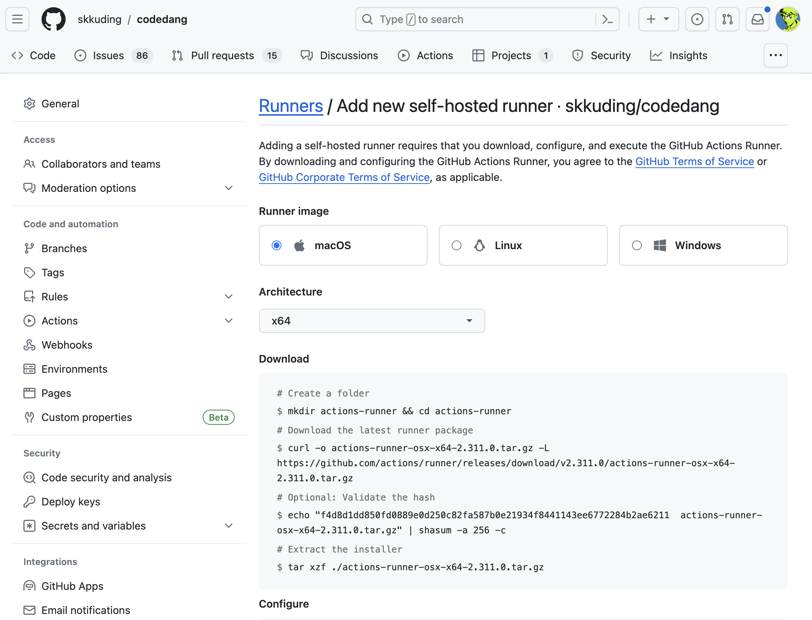

# Stage Server

스테이지 서버는 배포 전 테스트를 위한 서버로, [dev.codedang.com](https://dev.codedang.com/)에서 확인할 수 있습니다.



`main` 브랜치에 올라간 코드는 `deployment` environment에서 자동으로 스테이지 서버에 배포되며,
수동으로 production 배포를 trigger하면 `production` environment에서 진행합니다.

## Stage Server 세팅

### Prerequisite

- Docker
- PNPM
- 2 Core 4GB RAM 이상의 서버
- x86_64 CPU Architecture (ARM은 지원하지 않습니다.)

### 1. Docker 컨테이너 생성

우선 배포할 서버에 SSH로 접속 후, repository를 clone합니다.

```bash
git clone https://github.com/skkuding/codedang
```

그 후, `codedang` 폴더로 이동하여 Docker Compose를 `deploy` profile로 실행합니다.

```bash
docker compose --profile deploy up -d
```

### 2. Frontend Build (선택)

::: tip 어떤 경우에 build해야 하나요?
컨테이너 생성만 하면 frontend build는 진행되지 않습니다.
그래서 바로 서버에 접속하면 404 에러가 발생해요.
대신 GitHub Actions로 배포가 진행되면 frontend build가 자동으로 이뤄지고 접속이 가능해집니다.
하지만 GitHub Actions까지 세팅하기 전 바로 접속하고 싶다면 이 단계를 진행해주세요.
:::

`codedang` 폴더에서 frontend를 빌드합니다.

```bash
pnpm install
pnpm --filter frontend build
```

이후 Caddy 컨테이너에 빌드된 파일을 업로드하고 재시작합니다.

```bash
docker cp frontend/dist caddy:/var/www/html
docker exec -w /etc/caddy caddy caddy reload
```

이후 `https://<서버 주소>`로 접속하면, 화면이 나타납니다.

### 3. GitHub Action Runner 세팅

자동 배포를 위해 GitHub Action의 Self-hosted Runner로 등록합니다.

GitHub의 codedang repository에서 `Settings` > 좌측 사이드 바 `Actions` > `Runners` > `New self-hosted runner`를 클릭합니다.

이후 설명된 내용을 따라 Runner를 등록합니다.


