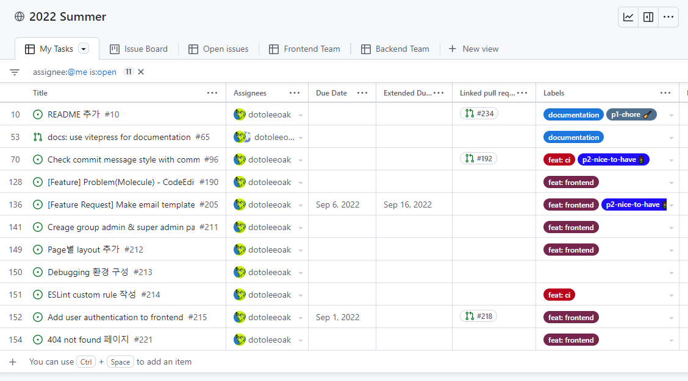

# Tech Stack

Coding Platform은 Frontend, Backend, DevOps 세 팀으로 나누어 프로젝트를 진행합니다.

| 분류 | Stacks |
|:--------:|-------------|
| 공통 | Visual Studio Code, GitHub, pnpm, Typescript, ESLint, Prettier, Lefthook |
| Frontend | Vue.js,  Vite, Tailwind CSS, Pinia, Histoire |
| Backend | Node.js, Nest.js,  Express, Mocha, Prisma, PostgreSQL, Redis |
| DevOps | Docker, AWS |

## 공통

### GitHub

프로젝트 코드 저장부터 이슈 관리, CI/CD 등 다양한 용도로 활용하고 있습니다.
GitHub Issues에 모든 task를 저장하여 스꾸딩 팀의 업무 단위로 활용하고 있고, pull request로 코드 리뷰를 거치며 의견을 교환합니다.
또한 GitHub Actions로 CI/CD 시스템을 구축하여 테스팅과 배포를 자동화하였습니다.

### pnpm

[pnpm](https://pnpm.io/)은 Node.js package manager로, npm과 yarn에 비해 월등히 속도가 빠르고 디스크 공간을 절약할 수 있습니다.
또한 monorepo 기능이 내장되어있어 frontend와 backend의 의존성을 별도로 관리하는 이 프로젝트에 적합합니다.
Frontend와 backend의 중복되는 의존성은 pnpm에 의해 모두 자동으로 하나로 관리됩니다.

::: tip
보통 라이브러리를 설치할 때 `npm i <name>` 또는 `yarn add <name>`처럼 NPM과 Yarn을 활용한 예시가 많습니다.
이를 그대로 따라하면 NPM 또는 Yarn의 lockfile이 새로 생성되고 pnpm의 것은 무시됩니다.
따라서 이 프로젝트에서는 `pnpm add <name>` 명령어를 이용하여 설치해야 합니다. (`devDependency`의 경우 `-D` 옵션을 추가해주세요!)
:::

::: warning
pnpm은 symbolic link를 적극적으로 사용하기 때문에 일부 라이브러리에서 관련 issue가 발생할 수 있습니다.
혹시 프로젝트에서 알 수 없는 문제가 발생했다면 pnpm을 키워드에 넣어 검색해보세요.
:::

### Typescript

[Typescript](https://www.typescriptlang.org/)는 Javascript에 정적 타입을 추가한 언어로, 엄격한 문법을 통해 생산성을 높입니다.
VSCode에 Typescript가 내장되어있어 자동 완성이나 문법 분석 등 여러 편의 기능을 제공하고, 다양한 이슈를 runtime이 아닌 build time에 잡을 수 있다는 강점이 있습니다.
Frontend는 Vue 3에서 Typescript를 적극적으로 지원하며, backend는 Nest.js가 Typescript를 기반으로 제작된 framework입니다.

### ESLint, Prettier

[ESLint](https://eslint.org/)는 정적 코드 분석 도구로, 문법적 오류나 컨벤션 위반 등을 잡아줍니다.
[Prettier](https://prettier.io/)은 자동 코드 formatter로, 일관된 코드 형식을 자동으로 잡아줍니다.
가이드에 맞춰 VSCode로 개발 환경을 제대로 구성했다면 ESLint와 Prettier은 자동으로 설정됩니다.
또한 commit hook과 CI 단계에도 적용되어있어 main branch에 반영되기 전에 오류를 검출합니다.

### Lefthook

[Lefthook](https://github.com/evilmartians/lefthook)은 Git hook을 관리해주는 도구로, 앞서 언급한 linting이나 formatting 등을 commit하는 시점에 실행해줍니다.
보통 Git hook 관리 도구로 Husky를 많이 사용하지만, Lefthook이 훨씬 속도가 빠르고 여러 기능들을 제공합니다.

## Frontend

### Vue 3

Frontend framework로 [Vue 3](https://vuejs.org/)을 사용합니다.
지금은 구현 편의 상 SPA를 사용하고 있지만, 추후 SSR 또는 SSG 적용을 위해 [Nuxt 3](https://v3.nuxtjs.org/)을 사용할 예정입니다.
아직 Nuxt 3을 도입하기에는 Nuxt 문서가 충분히 완성되지 않았고 stable release 단계에 이르지 않았기 때문에 Nuxt가 어느 정도 성숙해지면 도입할 예정입니다.
React와 Svelte 등의 대안을 두고 Vue를 사용한 이유는 다음과 같습니다.

- **React**: React는 frontend library 중 가장 큰 커뮤니티를 가지고 있어 자료 검색이나 라이브러리 도입이 쉽다는 장점이 있습니다.
또한 Next.js라는 훌륭한 SSR/SSG 용 framework도 있고, 채용 시장에서 수요도 제일 많습니다.
하지만 난이도가 비교적 높아 진입장벽이 높고 Vue에 비해 문법이 직관적이지 못합니다.
Vue 2에 대해서는 React가 Typescript 지원에서 크게 앞서있었지만, Vue 3에서는 Composition API로 여러 문제가 해결되며 React의 메리트가 줄어들었습니다.

- **Svelte**: Svelte는 신생 frontend library로 매우 직관적인 문법이 특징입니다.
하지만 신생 라이브러리인 만큼 학습 자료나 라이브러리가 부족하여 개발 경험이 적은 팀원들에게 적합하지 않습니다.
또한 [자체적으로 설계 문제](https://gist.github.com/rabelais88/19bfe8dfd29d901554389f0a8cc8947a)가 있어 추후 scalable한 운영이 어려울 수 있습니다.

기존에 스꾸딩 팀이 QingdaoU OJ 기반의 Online Judge를 구축할 때부터 Vue를 써온 것도 Vue를 택한 이유 중 하나입니다.
더 상세한 배경은 [issue #8](https://github.com/skkuding/next/issues/8#issuecomment-1065856244)에서 확인할 수 있습니다.

### Vite

[Vite](https://vitejs.dev/)는 Vue의 제작자인 Evan You가 만든 module bundler로, Vue 팀에서 공식적으로 권장하는 tool입니다.
ES module을 적극적으로 활용하고 dependecies를 esbuild로 bundle하기 때문에 매우 빠른 속도가 특징입니다.
사용하기 쉽고, 활용할 수 있는 plugin들도 많습니다.
이 프로젝트에서 사용하고 있는 plugin은 다음과 같습니다.

- [`vite-plugin-pages`](https://github.com/hannoeru/vite-plugin-pages): File system 기반의 routing을 자동으로 만들어줍니다.
- [`unplugin-icons`](https://github.com/antfu/unplugin-icons): Iconset들을 쉽게 불러올 수 있는 plugin입니다.
[Icônes](https://icones.js.org/)에서 아이콘들을 확인할 수 있습니다.

### Tailwind CSS

[Tailwind CSS](https://tailwindcss.com/)는 CSS framework로, utility-first라는 특징을 가지고 있습니다.
각각의 CSS 속성들이 CSS class로 정의되어있기 때문에 inline style처럼 style을 정의할 수 있습니다.
이 프로젝트에서 Tailwind CSS를 사용하는 이유는 (1) 진입장벽이 낮고 사용법이 쉬우며, (2) 일관된 look & feel을 구현하기에 용이하기 때문입니다.

### Pinia

[Pinia](https://pinia.vuejs.org/)는 기존의 Vuex를 대체하는 상태 관리 라이브러리로, Vue 팀에서 공식적으로 권장하고 있습니다.
직관적인 문법과 뛰어난 Typescript 지원 등이 특징입니다.

### Histoire

[Histoire](https://histoire.dev/)은 UI component를 위한 문서화 라이브러리로, 잘 알려진 [Storybook](https://storybook.js.org/)과 동일한 용도입니다.
Storybook 대신 Histoire을 사용하는 이유는 (1) Histoire은 Vue 문법을 사용하기 때문에 쉽고 간결하게 작성할 수 있고, (2) Vite가 내장되어있어 빠릅니다.
Histoire가 Storybook에 비하면 기능도 훨씬 적고 자료도 부족하지만, 간단한 문서화 용도로는 충분하다고 판단하였고, Vue가 익숙한 팀원들이 쉽게 작성할 수 있을 것이라 생각해 Histoire을 택하였습니다.

### 이 외

- [VueUse](https://vueuse.org/): 상태 관리, 시간, 반응형 등 다양한 유틸리티 함수들의 모음입니다.

- [NProgress](https://ricostacruz.com/nprogress/): 페이지 상단에 progress bar를 표시해줍니다.

## Backend

### Node.js

[Node.js](https://nodejs.org/ko/)는 서버에서 Javascript를 실행하는 runtime 환경입니다.
원래 Javascript는 웹 브라우저에서만 실행 가능하지만, Node.js는 Chrome의 V8엔진에 파일 시스템과 네트워킹 등의 API를 추가해 서버에서 활용할 수 있게끔 만들었습니다.
성능도 뛰어나고 frontend와 동일한 언어를 사용하기 때문에 의존성 관리가 용이합니다.

### NestJS

[NestJS](https://nestjs.com/)는 scalabe한 app을 만들기 위한 구조를 제공하는 framework입니다.
Python의 Django와 달리 Node.js에는 그동안 구조가 정해진 backend framework가 없었는데, 그 공백을 채운 것이 NestJS입니다.
그 구조가 Angular나 Java Spring과 유사하며 객체 지향(특히 Dependency Injection)을 핵심으로 합니다.

### Express

[Express](http://expressjs.com/ko/)는 Node.js 환경에서 가장 유명한 backend library로, 간단하게 web app을 만들 수 있습니다.
우리 프로젝트에서는 직접 Express를 쓰는 대신 NestJS가 Express를 감싸고 있습니다.
지금은 관련 자료가 풍부하다는 이유로 Express를 사용하고 있지만, 추후 성능 개선이 필요한 시점이 오면 [Fastify](https://www.fastify.io/)로 대체할 수 있습니다.

### Mocha

일반적으로 Node.js 생태계에서 testing framework로 [Jest](https://jestjs.io/)가 가장 많이 쓰이지만, Jest의 성능 문제로 우리 프로젝트에서는 [Mocha](https://mochajs.org)를 대신 사용합니다. (관련 issue: [#299](https://github.com/skkuding/next/issues/299))
Mocha와 함께 assertion 기능을 제공하는 [Chai](https://www.chaijs.com), mocking과 fake 함수 기능을 제공하는 [Sinon](https://sinonjs.org)을 사용합니다.

### Prisma

[Prisma](https://www.prisma.io/)는 ORM으로, 직관적으로 사용할 수 있고 Typescript를 적극적으로 지원합니다.
ORM이란 database에 SQL로 직접 query문을 전달하는 대신, Typescript 등의 언어로 mapping 시켜주는 도구를 말합니다.
Prisma는 각 model들을 type으로 생성해주기 때문에 Typescript로 쉽게 query문을 작성할 수 있습니다.

### PostgreSQL

[PostgreSQL](https://www.postgresql.org/)은 널리 쓰이는 관계형 database입니다.
많이 비교되는 MySQL보다 다양한 기능을 제공합니다.

### Redis

[Redis](https://redis.io/)는 in-memory 저장소로, 이 프로젝트에서는 주로 caching과 message queue를 위해 쓰입니다. (추후 message queue는 Amazon SQS으로 대체할 수 있습니다)

## DevOps

::: warning Work in Progress 🚧
배포 완료 후 작성 예정입니다!
:::
