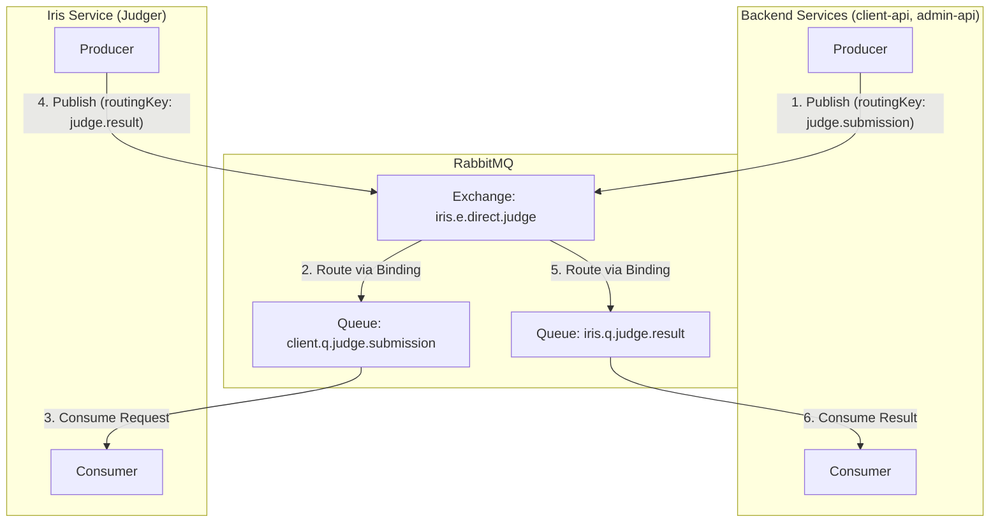
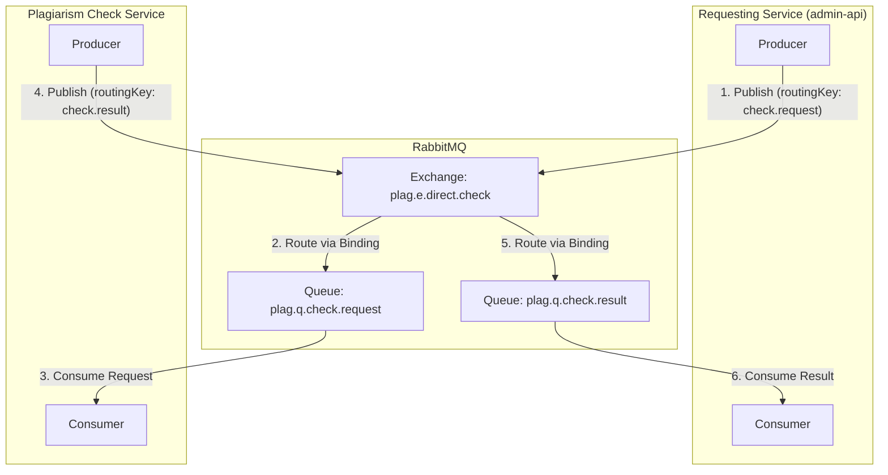

# RabbitMQ Architecture

This document outlines the RabbitMQ topology used in the Codedang project, managed via Kubernetes manifests. The resources are organized **by domain** to improve clarity and maintainability.

## Overview

We use RabbitMQ for asynchronous communication between services, primarily for code submission judging and plagiarism checks. The topology is defined in the `base/` directory and managed by Kustomize.

- **`base/topology-judging.yaml`**: Defines all resources (Exchange, Queues, Bindings) related to the code **judging feature**.
- **`base/topology-plagiarism.yaml`**: Defines all resources for the **plagiarism check feature**.

## 1. Judging Topology

This topology handles the workflow for judging user code submissions. The `client-api` and `admin-api` services can initiate a request, the `Iris` service (judger) processes it, and the result is sent back to the `client-api`.

### Diagram



### Flow

1.  **Submission Request**: The `client-api` or `admin-api` service publishes a judge request message to the `iris.e.direct.judge` exchange with the routing key `judge.submission`.
2.  **Routing to Iris**: The exchange routes the message to the `client.q.judge.submission` queue.
3.  **Processing**: The `Iris` service consumes the message from the queue, performs the code judging, and prepares the result.
4.  **Result Publication**: `Iris` publishes the result message back to the same `iris.e.direct.judge` exchange, but with the routing key `judge.result`.
5.  **Routing to Backend**: The exchange routes the result message to the `iris.q.judge.result` queue.
6.  **Result Handling**: The `client-api` service consumes the result message from the queue and updates the submission status in the database.

## 2. Plagiarism Check Topology

This topology is designed for handling plagiarism check requests. A service sends a request, and a dedicated plagiarism checker service processes it and returns a result.

### Diagram



### Flow

1.  **Check Request**: The `admin-api` service publishes a plagiarism check request to the `plag.e.direct.check` exchange with the routing key `check.request`.
2.  **Routing to Checker**: The exchange routes the message to the `plag.q.check.request` queue.
3.  **Processing**: A dedicated plagiarism check service consumes the message and performs the analysis.
4.  **Result Publication**: The checker service publishes the result to the `plag.e.direct.check` exchange with the routing key `check.result`.
5.  **Routing to Requester**: The exchange routes the result to the `plag.q.check.result` queue.
6.  **Result Handling**: The original requesting service consumes the result for further action.

## How to setup RabbitMQ

1. Install RabbitMQ operator

Prerequisites: cert-manager installed

```sh
# RabbitMQ Cluster Operator
kubectl apply -f "https://github.com/rabbitmq/cluster-operator/releases/latest/download/cluster-operator.yml"

# RabbitMQ Messaging Topology Operator
kubectl apply -f "https://github.com/rabbitmq/messaging-topology-operator/releases/latest/download/messaging-topology-operator-with-certmanager.yaml"
```
